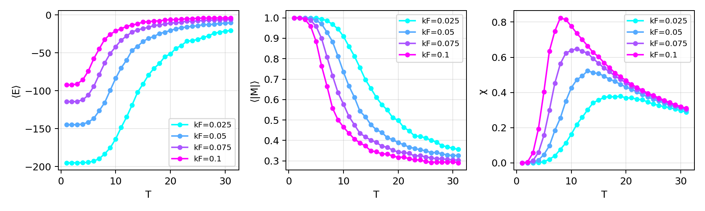

# Monte Carlo Simulation of RKKY-Coupled Magnetic Impurities in Two Dimensions

This repository provides a Python-based implementation of Monte Carlo simulations for a two-dimensional lattice of magnetic impurities coupled via long-range RKKY interactions. The system is modeled as classical Ising spins randomly distributed on a triangular lattice, and simulations are performed using both the Metropolis algorithm and a modified Wolff cluster update algorithm that respects the oscillatory nature of RKKY coupling.

---


## Features

- **Customizable lattice parameters**: triangular geometry, doping level, interaction constants.
- **Long-range oscillatory interaction**: modeled via 2D RKKY theory with Bessel functions.
- **Two update algorithms**:
  - Local updates via the Metropolis-Hastings algorithm.
  - Global cluster updates via a detailed-balance-preserving Wolff algorithm (supports AFM/FM bonds).
- **Autocorrelation-aware statistics**: integrated autocorrelation time used to adaptively determine thermalization.
- **Visualization tools**: includes real-space spin plots, correlation functions ⟨SᵢSⱼ⟩(r), and their Fourier transforms.

---

## Installation

Python 3.8+ is recommended. To install the required dependencies:

```bash
pip install numpy scipy matplotlib tqdm
````

---


## Project Structure

```

monte-carlo-PtSe2/
│
├── example.ipynb                # Minimal example
├── lattice.py                   # Disordered triangular lattice + RKKY J\_ij
├── monte\_carlo.py               # Metropolis / Wolff engines (+warmup GIF)
├── accumulator.py               # Observables & autocorrelation helpers
├── visualization.py             # Lattice/cluster/structure-factor plots
├── plot\_observables.py          # Class to run & plot E, |M|, χ over (δ, kF)
└── plots/                       # Figures output (created at runtime)

````

---

## Quick start

### A) Run and plot observables over (δ, kF)
```python
from plot_observables import ObservablesGrid

runner = ObservablesGrid(
    deltas=(0.025, 0.05, 0.075, 0.10),
    kfs=(0.025, 0.05, 0.075, 0.10),
    L=14, J0=-1.0,
    # T_grid=np.linspace(2.0, 31.0, 30)
)

# Compute only what's needed for the specific plots:
runner.plot_by_kf(delta=0.05)   



runner.plot_by_delta(kf=0.05)  


# Heatmap of χ-peak temperature T_peak(δ, kF) – will compute missing points:
runner.plot_peak_map("T_peak")  # makes plots/map_Tpeak.png
````

### B) Warmup animation (GIF) with Wolff clusters

```python
from lattice import Lattice
from monte_carlo import MonteCarlo

rows = cols = 12
delta, kf, J0 = 0.10, 0.10, -1.0
T = 15.0

lat = Lattice(rows, cols, delta, kf=kf, J0=J0)
mc  = MonteCarlo(lat)

# Will save frames to 'warmup_frames/' and create GIF 'wolff_15.0_warmup.gif'
mc.run_loop(
    warmup_steps=200, steps=0, T=T,
    method="wolff",
    save_warmup=True, outdir="warmup_frames"
)
# GIF is saved automatically by monte_carlo.run_loop as: wolff_<T>_warmup.gif
```


**Warmup GIF (Wolff):** `wolff_15.0_warmup.gif`

```
